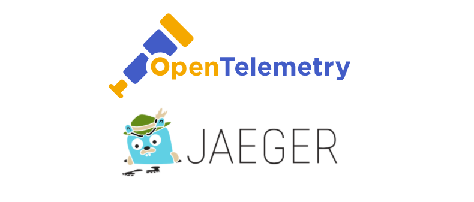

# OpenTelemetry With Java

### Open Telemetry

[OpenTelemetry](https://opentelemetry.io/) is a set of tools, APIs, and SDKs for application instrumentation to collect and export metrics, logs, and traces in a standardized way. Its goal is to provide visibility in distributed environments and improve system observability.

In this project, OpenTelemetry is used to track API requests, integrating with **Jaeger** to visualize traces and with **PostgreSQL** to analyze query performance.

### Jaeger

[Jaeger](https://www.jaegertracing.io/) is an open-source, end-to-end distributed tracing system developed by Uber. It helps with monitoring and troubleshooting microservices-based architectures by providing insights into request flows, identifying bottlenecks, and debugging latency issues.

## <u>Recursos adicionales</u>
- [Open Telemetry Docs](https://opentelemetry.io/docs/)
- [Open Telemetry Repository](https://github.com/open-telemetry/opentelemetry-java)
- [Jaeger Docs](https://www.jaegertracing.io/docs/2.3/getting-started/)

